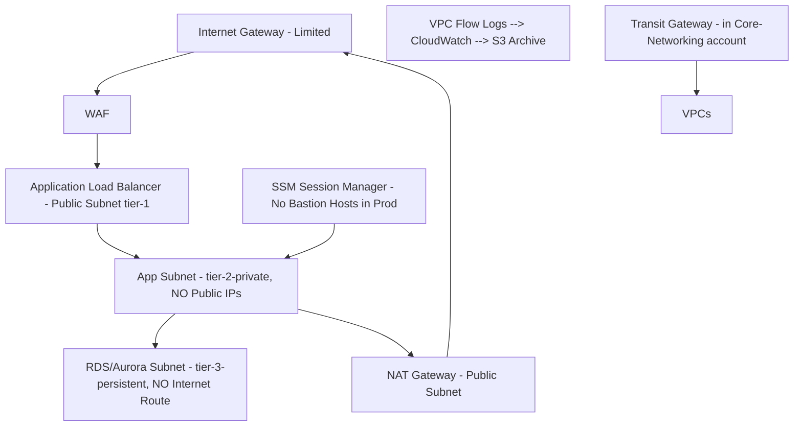

## 1. Purpose and Scope

### 1.1 Purpose
This Standard Operating Procedure (SOP) establishes the mandatory technical and administrative controls governing Meridian’s use of Amazon Web Services (AWS) and Microsoft Azure cloud environments. It defines the security architecture, configuration baselines, identity and access management protocols, data protection measures, and continuous monitoring requirements necessary to protect the confidentiality, integrity, and availability of all Meridian systems and data hosted in cloud environments. This SOP operationalizes the shared responsibility model and ensures that Meridian’s cloud deployments meet or exceed the requirements of SOC 2 Trust Services Criteria (Security, Availability, and Confidentiality), HITRUST CSF, ISO 27001:2022, and contractual obligations to Meridian’s customers.

### 1.2 Scope
This SOP applies to:

- **Personnel:** All Meridian employees, contractors, consultants, interns, and third-party service providers (collectively "Personnel") who design, deploy, configure, manage, monitor, or decommission cloud resources within Meridian’s AWS Organization or Azure tenant.
- **Environments:** All Meridian AWS accounts (including production, staging, development, sandbox, and data science environments) governed under the `meridian-aws-organization` master payer account; all Azure subscriptions under the `meridian.com` Azure Active Directory tenant; and any future cloud service provider (CSP) environments approved by the Chief Information Security Officer (CISO).
- **Services:** Infrastructure-as-a-Service (IaaS), Platform-as-a-Service (PaaS), and Software-as-a-Service (SaaS) offerings consumed by Meridian business units, including but not limited to: EC2, S3, RDS, Lambda, ECS, EKS, VPC, IAM, CloudTrail, Config, GuardDuty, Macie, WAF, Shield (AWS); Virtual Machines, Blob Storage, SQL Database, Azure Kubernetes Service, Virtual Network, Entra ID, Monitor, Sentinel, Defender for Cloud (Azure).
- **Data:** All Meridian data classified as "Internal" or above per the Meridian Data Classification Policy (SOP-ISEC-004), including Protected Health Information (PHI), Personally Identifiable Information (PII), intellectual property, financial data, and system logs stored, processed, or transmitted in cloud environments.

**Out of Scope:** On-premises data centers (governed by SOP-ISEC-007); end-user devices (governed by SOP-ISEC-012); SaaS applications not hosted within Meridian's AWS or Azure environments (governed by the Vendor Security Management SOP, SOP-VRM-002).

---

## 2. Definitions and Acronyms

| Term/Acronym | Definition |
|---|---|
| **AWS** | Amazon Web Services, Meridian's primary IaaS/PaaS provider. |
| **Azure** | Microsoft Azure, Meridian's secondary IaaS/PaaS provider for select business applications. |
| **CIS** | Center for Internet Security. Meridian adopts CIS Benchmarks as the foundational configuration standard for all cloud resources. |
| **CSP** | Cloud Service Provider (AWS, Azure). |
| **CISO** | Rachel Kim, Chief Information Security Officer, owner of this SOP. |
| **Cloud Security Posture Management (CSPM)** | Tools and processes for continuously monitoring cloud environments for misconfigurations and policy violations (Meridian uses Wiz). |
| **Cloud Workload Protection Platform (CWPP)** | Tools securing cloud workloads (VMs, containers, serverless) at runtime (Meridian uses CrowdStrike Falcon Cloud Security). |
| **Control Plane** | The APIs and management interfaces used to configure cloud resources (e.g., AWS Management Console, AWS CLI, Azure Portal, Azure CLI). |
| **Data Plane** | The infrastructure where customer data resides and is processed (e.g., EC2 instances, S3 buckets, Azure VMs). |
| **Entra ID** | Microsoft's cloud-based identity and access management service (formerly Azure Active Directory). |
| **GuardDuty** | AWS threat detection service that continuously monitors for malicious or unauthorized behavior. |
| **IAM** | Identity and Access Management. |
| **Infrastructure as Code (IaC)** | Managing and provisioning cloud infrastructure through machine-readable definition files (Meridian uses Terraform and AWS CloudFormation/CDK). |
| **Macie** | AWS data security service using machine learning for discovering, classifying, and protecting sensitive data in S3. |
| **PHI** | Protected Health Information, as defined by applicable law. |
| **PII** | Personally Identifiable Information. |
| **SCP** | Service Control Policy, an AWS Organizations feature defining maximum permissions for accounts. |
| **Sentinel** | Microsoft's cloud-native SIEM and SOAR solution. |
| **Shared Responsibility Model** | The CSP is responsible for Security *of* the Cloud; Meridian is responsible for Security *in* the Cloud. |
| **Single Sign-On (SSO)** | Authentication allowing users to access multiple applications with one set of credentials (Meridian uses Okta). |
| **SOC 2** | System and Organization Controls 2, Trust Services Criteria for Security, Availability, and Confidentiality. |
| **Trust Services Criteria (TSC)** | The control criteria used in a SOC 2 examination: CC1.x (Common Criteria – Control Environment), CC5.x (Control Activities), CC6.x (Logical and Physical Access Controls), CC7.x (System Operations), CC8.x (Change Management), CC9.x (Risk Mitigation). |
| **Wiz** | Meridian's enterprise Cloud Security Posture Management (CSPM) platform. |

---

## 3. Roles and Responsibilities

The following RACI matrix defines the roles and responsibilities for the activities governed by this SOP.

| Activity / Task | CISO (Rachel Kim) | VP, Cloud Infrastructure (Marcus Chen) | Cloud Security Engineer | DevOps Lead | Cloud Architect | Compliance Analyst | All Cloud Users |
|---|---|---|---|---|---|---|---|
| **Policy Governance** — Approve cloud security standards, exception requests, and significant architectural changes. | A | R | C | I | C | I | I |
| **Security Architecture** — Design secure cloud account structures, network topology (VPCs/VNets), IAM models, and encryption strategies. | I | A | R | C | R | I | I |
| **IaC Security** — Develop and maintain secure Terraform/CDK modules; enforce policy-as-code. | I | A | R | R | C | I | I |
| **Configuration Baseline Enforcement** — Implement and tune CSPM policies in Wiz; review and remediate alerts. | I | A | R | C | I | I | I |
| **IAM Management** — Operate IAM lifecycle; review access; enforce least privilege across Meridian's AWS Organization and Azure tenant. | I | A | R | I | I | I | I |
| **Logging & Monitoring** — Maintain CloudTrail, Config, GuardDuty, Sentinel, and Wiz; monitor dashboards. | I | A | R | C | I | I | I |
| **Incident Response (Cloud)** — Detect, investigate, and contain cloud security incidents per SOP-ISEC-002. | A | R | R | C | I | I | I |
| **Exception Requests** — Submit and justify requests to deviate from this SOP. | I | A | C | I | I | I | R |
| **Compliance Reporting** — Generate SOC 2 evidence packages; map controls to TSC. | A | I | C | I | I | R | I |
| **Training Completion** — Complete required annual cloud security training. | C | C | C | C | C | C | R |
| **Daily Secure Operation** — Adhere to Least Privilege; do not hardcode secrets; do not open S3 buckets/Securities to `0.0.0.0/0`. | I | I | I | I | I | I | R |

*Key: R = Responsible (Doer), A = Accountable (Approver), C = Consulted (Input), I = Informed*

---

## 4. Policy Statements

Meridian's Board of Directors, through the Office of the CEO, has established the following high-level policy commitments for cloud security. These statements are non-negotiable. Any deviation requires a formal exception approved by the CISO per Section 8 of this SOP.

1. **Shared Responsibility Acknowledgment:** Meridian formally acknowledges and operationalizes the AWS and Azure Shared Responsibility Models. Meridian accepts full responsibility for security "in" the cloud: customer data, identity and access management, platform and application configuration, operating system and network configuration, firewall configuration, client-side and server-side encryption, and intrusion detection/prevention systems deployed within Meridian's Virtual Private Cloud (VPC) and Virtual Networks (VNet).

2. **Least Privilege by Default:** All cloud identities (human users, machine roles, service principals) shall be granted exclusively the minimum permissions required to perform their authorized function. No principal shall hold `AdministratorAccess` (AWS) or ` Global Administrator` (Azure) except under strictly controlled break-glass procedures with mandatory CISO notification within 1 hour.

3. **Infrastructure-as-Code Mandate:** All production cloud infrastructure shall be defined, provisioned, and managed exclusively through Meridian's approved IaC pipelines (Terraform Enterprise or AWS CDK) stored in the `meridian-infracode` Bitbucket repository. Manual console-based creation of any production resource is strictly prohibited except for authorized emergency break-glass scenarios.

4. **CIS Benchmark Alignment:** Every deployed cloud resource shall be configured in continuous compliance with the applicable CIS Benchmark for AWS (currently v1.5.0) and Azure (currently v1.5.0). Wiz CSPM shall be configured to continuously assess against these benchmarks. A CIS compliance score below 98% for any Meridian AWS account or Azure subscription is automatically escalated.

5. **Data Encryption Everywhere:** All Meridian data classified as "Internal" or above, at rest in any cloud storage service, shall be encrypted using customer-managed keys (CMK) from AWS Key Management Service (KMS) or Azure Key Vault. All data in transit across untrusted networks shall be encrypted using TLS 1.2 or higher. Server-side encryption with provider-managed keys is acceptable only for ephemeral logs with a TTL under 24 hours.

6. **Immutable Logging:** All configuration changes and data-plane access across all cloud environments shall be logged in an immutable, centralized log archive completely isolated from all operational accounts. No role, including root/Global Admin, shall possess the ability to delete or modify logs in this archive for a minimum retention period of 365 days.

7. **Continuous Security Posture Monitoring:** Meridian shall deploy and maintain automated, real-time configuration monitoring across 100% of cloud resources using Wiz. Any resource found to be in violation of a "Critical" or "High" severity policy is considered a Priority 1 (P1) security incident.

8. **Zero Trust for Control Plane:** No console or CLI access to the cloud control plane from an untrusted network is permitted. All access must traverse Meridian's SSO (Okta), require phishing-resistant MFA (FIDO2 WebAuthn/YubiKey), and pass through a centralized, monitored bastion host or privileged access workstation (PAW).

---

## 5. Detailed Procedures

This section provides the step-by-step procedures for implementing the policy statements. All Personnel executing these procedures must be aware that their actions are auditable, and evidence is collected continuously for SOC 2 control testing against TSC CC6.1, CC6.3, CC7.2, and CC8.1.

### 5.1 Meridian's AWS Organization Account Structure

All AWS accounts at Meridian shall be governed under a single AWS Organization (`o-abc123xyz`) with consolidated billing. The following Organizational Unit (OU) structure is mandatory and shall be enforced through Service Control Policies (SCPs).

| OU Name | Purpose | SCP Policy (High-Level) | Key Accounts |
|---|---|---|---|
| `Security-Tooling` | Houses security tools, logging archive, and security audit roles. | DENY all deletions of S3 buckets, CloudTrail trails, Config recorders, and GuardDuty detectors. | `meridian-logarch- prod`, `meridian-secops- prod` |
| `Production` | Hosts all customer-facing applications and PHI data. | DENY creation of resources in unapproved regions (e.g., China, GovCloud without explicit authorization); DENY stopping of CloudTrail; DENY public S3 bucket creation via explicit `aws:SecureTransport: false` condition. | `meridian-phr-prod`, `meridian-analytics- prod` |
| `Staging` | Pre-production environment mirroring Production for integration testing. | DENY public S3 bucket creation. | `meridian-staging` |
| `Development` | Developer sandboxes. No PHI permitted. | DENY public S3 bucket creation. | `meridian-dev`, `meridian-ml-dev` |
| `Sandbox` | Temporary, project-based accounts for experimentation. Auto-deleted after 30 days unless a renewal request is approved by VP, Cloud Infrastructure. | DENY large EC2 instance types, DENY RDS creation, full Internet Gateway creation restricted. | `meridian-sb-project-alpha` |
| `Core-Services` | Hosts shared networking (Transit Gateway) and centralized DNS. | DENY deletion of Transit Gateway, Route53 private hosted zones, and VPC Flow Logs. | `meridian-networking- prod` |

**Procedure 5.1.A — New Account Provisioning:**
1. **Requestor:** Submit a "New AWS Account Request" via Jira Service Management, specifying business justification, OU target (`Staging`, `Dev`, etc.), estimated monthly spend, and whether PHI will be processed.
2. **Approval:** `VP, Cloud Infrastructure` (or delegate) reviews and approves within 24 business hours.
3. **Provisioning (Automated via Terraform):**
    a. Terraform invokes the AWS Organizations API to create the new account within the specified OU.
    b. The baseline stack is deployed automatically: IAM role `meridian-sec-audit` is created, trusting the `Security-Tooling` OU's `meridian-audit-executor` role for read-only security scanning. A default VPC is deleted and replaced with a sanctioned, pre-configured VPC with no Internet Gateway.
    c. The account is enrolled in AWS Config, recording all resources globally, with a conformance pack deploying the "Operational Best Practices for CIS AWS Foundations Benchmark v1.4.0".
    d. GuardDuty is activated and members associated with the Delegated Administrator.
    e. A mandatory SCP attached from the parent OU restricts root user API keys and mandates MFA for the root user.
4. **Notification:** The system posts a notification to the `#cloud-infra` Slack channel with the new account ID, OU, and assigned Security Contact (the requestor).

### 5.2 Identity and Access Management (IAM) Standard

Control Objective (SOC 2 CC6.1 — Logical Access Security): Restrict logical access to Meridian's cloud environments to authorized users based on the principle of least privilege.

**5.2.1 AWS IAM — Core Rules:**
- **Human Users (Federated via Okta):** No human shall possess long-term IAM user access keys. All human access to the AWS Management Console and CLI shall be federated through Meridian's Okta tenant. Roles in AWS shall be defined with trust policies pointing exclusively to Okta SAML assertions. Each role must map clearly to a business function (e.g., `meridian-devops-readonly`, `meridian-s3-data-mgmt`).
- **Break-Glass Role (`meridian-emergency-admin`):** A single, highly monitored IAM role exists for emergency console access. This role has `AdministratorAccess` trusted ONLY by a specific, rarely used Okta group of 4 senior engineers. Any assumption of this role triggers a PagerDuty alert for the Cloud Security Engineering team and CISO immediately.
- **Machine Identities (IAM Roles for Services):** EC2 instances, Lambda functions, ECS tasks, and Glue jobs must utilize IAM roles with precisely scoped permissions defined in Terraform. No application code shall embed `aws_access_key_id` or `aws_secret_access_key`.

**Procedure 5.2.A — IAM Policy Authoring (Least Privilege):**
1. **Engineer** begins work on a new function in the Dev account. Any attempt to attach the broad policy `ReadOnlyAccess` will be blocked by a preventive SCP. The engineer must instead analyze the required API calls from code logic or CloudTrail logs from Staging (if refactoring).
2. **Engineer authors a new IAM policy in the `meridian-infracode` repository's `iam/policies` directory, using Meridian's standard `data "aws_iam_policy_document"` data source. Policy must scope:
    - **Actions:** Explicitly allow only the necessary API calls (e.g., `s3:GetObject`, not `s3:*`).
    - **Resources:** ARN-level scoping (e.g., `arn:aws:s3:::meridian-phr-input- bucket/*`).
    - **Conditions:** Include mandatory conditions: `"aws:SecureTransport": "true"` (to block unencrypted access), `"aws:RequestedRegion": "us-east-1"` (for region control if needed).
3. **Pull Request (PR)** is submitted. The `cloud-sec- reviewers` team is automatically assigned as reviewers.
4. **Cloud Security Engineer** reviews the policy using IAM Access Analyzer policy validation in the PR pipeline. Security checks: Is any Action overly permissive? Is the Resource an unreasonably broad wildcard? Could this permission be chained with another role to escalate privileges?
5. **Approval:** PR merged only upon approval from a Cloud Security Engineer.
6. **Deployment:** The merged policy, alongside the IAM Role definition, is deployed via Terraform Cloud.

**5.2.2 AWS Root User Credential Management:**
- The AWS root user email addresses for all accounts use the `aws-root+<account-alias>@meridian.com` distribution list, which goes to the CISO and VP, Cloud Infrastructure.
- All root user passwords are 30+ character, machine-generated strings stored exclusively in the Breakglass partition of 1Password Business.
- All root user accounts are protected with MFA (FIDO2 security keys stored in the CISO's physical safe).
- Root user API access keys are deleted or deactivated. If a scenario requires root API keys (rare), Procedure 5.2.B must be followed precisely.

**Procedure 5.2.B — Conditional Root API Access Key Usage:**
1. **Engineer** identifies a task documented by AWS as requiring root (e.g., specific S3 bucket policy unlocking, account closure tasks).
2. **Engineer** submits a Change Request (CR) in Jira. `VP, Cloud Infrastructure` and `CISO` must approve.
3. At the scheduled maintenance window, `CISO` physically retrieves the root MFA key.
4. `CISO` accesses the account, generates a temporary root API key pair.
5. `Engineer` performs the task under `CISO's` supervision in a shared terminal session. The engineer may never see the root credentials.
6. Upon task completion, `CISO` immediately deletes the API key pair from the IAM console.
7. `CISO` closes the CR, recording the action taken and duration.

### 5.3 Network Security Architecture

Control Objective (SOC 2 CC6.6 — Network Security): Restrict external and internal network communications to protect data in transit and shield cloud infrastructure from unauthorized access.

#### 5.3.1 Meridian's AWS Network Architecture Standard
The standard multi-account VPC design, deployed via the `terraform-aws-meridian-network` module, is mandatory for all Production and Staging OUs.

- **Subnet Segmentation:** Every VPC must implement a minimum 3-tier architecture: Public (ALB, NATGW, WAF), Private-Application (EC2/ECS/EKS), and Private-Data (RDS, ElastiCache, OpenSearch). Strict Network ACLs (NACLs) and Security Groups (SGs) enforce tier boundaries.
- **No Public IPs on Instances:** No EC2 instance in the `Private-Application` or `Private-Data` tiers shall have a public IP address associated. Outbound internet access is permitted exclusively through centrally managed NAT Gateways for OS patching.
- **Zero Trust Administrative Access:** No bastion host or jump box is permitted in Production. All administrative access to EC2 instances is provided exclusively via AWS Systems Manager Session Manager, which provides IAM-integrated auditable shell access with logging to S3 and CloudWatch.
- **VPC Endpoints:** All AWS API calls from within a VPC must traverse a VPC Endpoint (Gateway for S3/DynamoDB, Interface for EC2, SSM, ECR, CloudWatch, etc.). An SCP prevents any `ec2:CreateRoute` or other action that could route traffic through an IGW or NATGW for these services, enforcing Endpoint usage.
- **Security Groups as Micro-segmentation:** Security Groups shall follow a strict least-privilege model, referencing other SGs by ID, not CIDR ranges, wherever possible. Example: ALB (`sg-alb`) allows TCP/443 from `0.0.0.0/0`; App Instances (`sg-app`) allow TCP/443 from `sg-alb`; DB Cluster (`sg-db`) allows TCP/3306 from `sg-app`. No SG rule shall ever allow `0.0.0.0/0` ingress on common database ports (3306, 1433, 5432, 27017).

### 5.4 Data Security Standards

Control Objective (SOC 2 CC6.1, CC6.7 — Data Encryption and Management): Protect data at rest and in transit, and manage the lifecycle of encryption keys.

#### 5.4.1 Amazon S3 Bucket Hardening Standard
Every Meridian S3 bucket, upon provisioning via Terraform, must conform to the following zero-trust baseline. Wiz enforces these settings continuously; any bucket found non-compliant is reported as a Critical Finding, triggering a P1 alert.

1.  **Public Access Block (All Four Flags):** `BlockPublicAcls: true`, `IgnorePublicAcls: true`, `BlockPublicPolicy: true`, `RestrictPublicBuckets:true` must be set to `true`. This is enforced at the account level via SCP. No bucket policy shall ever grant a `Principal: "*"` with `"s3:GetObject"`.
2.  **Default Encryption:** Buckets must have a default encryption configuration set. For PHI buckets, this is `aws:kms` using the dedicated `meridian-phr-kms-key` CMK. For non-PHI, `AES256` (SSE-S3) is the minimum.
3.  **Secure Transport Enforcement:** Every bucket policy must include an explicit DENY for any `s3:GetObject`, `s3:PutObject`, etc., if `"aws:SecureTransport": "false"`.
4.  **Object Lock and Versioning:** For PHI buckets, Versioning and Object Lock in Governance mode with a 7-day retention period are mandatory to protect against accidental or malicious deletion, including insider threats.
5.  **Access Logging:** All critical data buckets must have Server Access Logs (SAL) enabled to a dedicated, tightly controlled `meridian-s3-accesslogs- <region>` logging bucket.

#### 5.4.2 Database Encryption (RDS / Aurora)
- **Encryption at Rest:** Mandatorily enabled at deployment via IaC. The KMS CMK for the database cluster must be a dedicated key, not the default `aws/rds`.
- **Automated Backups and Snapshots:** All automated backups and manual snapshots inherit encryption from the cluster’s CMK. Copying a snapshot to another region for DR requires a re-encryption to a region-specific CMK.

**Procedure 5.4.A — PHI Bucket Access Audit (Monthly):**
1.  **Cloud Security Engineer** executes the "PHI Bucket IAM Audit" script from the `meridian-security-scripts` repository.
2.  The script generates a report for all 14 identified PHI S3 buckets, enumerating:
    - All IAM policies (Users, Roles, Groups) globally that have any `s3:Get*` or `s3: List*` permission against each bucket's ARN.
    - All bucket ACLs (if any — must be empty).
    - All bucket policies.
3.  **Access Validation:** For each identity with access, the engineer meets with the Data Custodian (the bucket owner business unit lead) to validate ongoing business need. All access must follow a documented "need-to-know" basis.
4.  **Remediation:** Any unauthorized or stale access is immediately revoked via a Pull Request.
5.  **Evidence:** The final report, signed by the engineer and the Data Custodian, is uploaded to the SOC 2 evidence repository in the Compliance Analyst's shared drive as evidence for CC6.3.

### 5.5 Infrastructure as Code (IaC) Security Pipeline

Control Objective (SOC 2 CC8.1 — Change Management): Authorize and test infrastructure changes prior to production deployment to prevent unauthorized modifications affecting security.

Meridian's IaC pipeline is the gatekeeper for all production changes.

**Procedure 5.5.A — Secure IaC Deployment Workflow:**
1.  **Code Commit:** An engineer commits a Terraform module change to a feature branch in the `meridian-infracode` Bitbucket repository.
2.  **Static Analysis (Pre-commit):** Locally, a `pre-commit` hook runs `checkov` and `tfsec`. If critical security errors are found, the commit is rejected.
3.  **Pull Request & CI Pipeline:**
    a. **Bitbucket Pipelines Stage 1 — IaC Security Scan (`checkov` & `tfsec`):** Scans the HCL code for misconfigurations (e.g., an S3 bucket without encryption, a Security Group with `0.0.0.0/0`). A gate is set: 0 High, 0 Medium. **Failure = Build stops.**
    b. **Bitbucket Pipelines Stage 2 — Plan in Staging (`terraform plan`):** The `terraform plan` command executes against the Meridian Staging environment. The output is posted directly into the Bitbucket PR as a comment.
4.  **Mandatory Code Review:**
    a. The `cloud-sec- reviewers` group and the requesting engineer's DevOps Lead are added. Neither the author nor their direct peer can solely approve.
    b. The reviewer inspects the `plan` output, confirming the new/modified resource aligns with policy. They verify the new IAM policy is scoped correctly, the S3 bucket has Public Access Block on, etc.
5.  **Merge and CD Pipeline:**
    a. **Bitbucket Pipelines Stage 3 — Apply to Staging (`terraform apply -auto-approve`):** The code is deployed to the Staging account. Automated integration tests (including a Wiz scan) execute against Staging. Any security policy violation causes an automatic rollback (`terraform destroy`).
    b. **Bitbucket Pipelines Stage 4 — Production Approval Gate:** The pipeline pauses and requests manual approval from the `VP, Cloud Infrastructure` or their explicitly delegated DevOps Lead. This is a manual, human-in-the-loop confirmation that the Staging plan and tests look correct.
    c. **Bitbucket Pipelines Stage 5 — Apply to Production (`terraform apply`):** The authorized approver clicks "Proceed". Terraform Cloud executes the exact, reviewed, digitally signed module against the Production accounts.

### 5.6 Cloud Access Security Broker (CASB) and Data Loss Prevention (DLP)

Meridian uses Netskope as its CASB to provide an additional layer of control between Meridian personnel and the cloud control planes (AWS Console, Azure Portal) and for SaaS data flow visibility. This is a critical compensating control for SOC 2 CC6.1 and CC6.6.

- **Step-Down Authentication:** Any access to `*.console.aws.amazon.com` is intercepted by Netskope. The policy verifies the user's device posture (via Okta Verify posture check) before granting the SAML assertion, effectively downgrading a user's broad SSO access if they are on a non-corporate device.
- **Activity Monitoring:** All AWS `cloudtrail` management events are mirrored and correlated with Netskope's user-level context. The SIEM (Splunk) ingests both datasets. A correlation search fires an alert if a user deletes a CloudTrail trail via an anomalous IP geolocation, even if they hold the right IAM permissions.
- **Data Exfiltration Prevention:** Netskope’s Real-time Protection policy is configured to block downloads of files classified as "Meridian — Confidential" from AWS S3 via the Console to an unmanaged device. This is a key SOC 2 CC6.7 control for data confidentiality.

---

## 6. Controls and Safeguards

This section enumerates the specific controls, organized by SOC 2 Trust Services Criteria categories, that operationalize the Policy Statements and Procedures defined above. Each control has an assigned Owner and a Measurable Metric.

### 6.1 CC6.x — Logical and Physical Access Controls (Security)

| Control ID | Control Description | CSP | Owner | Metric & Target |
|---|---|---|---|---|
| **CC6.1- CLOUD-01** | **IAM Least Privilege Automation:** A Wiz policy automatically identifies IAM principals with more than 5 unused permissions and generates a Jira Story for the owning team. | AWS | Cloud Security Engineer | **Target:** 0 principals with >5 unused permissions >90 days. **KPI:** Mean Time to Remediate (MTTR) unused permissions: < 30 days. |
| **CC6.1- CLOUD-02** | **Break-Glass Monitoring:** Splunk SIEM generates a Critical alert to `#secops-p1-alerts` immediately upon assumption of the `meridian- emergency-admin` break-glass role. | AWS | SOC Analyst | **Target:** 100% of break-glass events are acknowledged and a ticket is created within 5 minutes. |
| **CC6.1- CLOUD-03** | **Root User Activity Monitoring:** AWS Config rule monitors for any root user console sign-in or API key usage across the Organization. | AWS | Cloud Security Engineer | **Target:** 0 events. **KPI:** If an event occurs, a formal Incident Postmortem is required within 72 hours. |
| **CC6.3- CLOUD-11** | **PHI Bucket Access Recertification:** Monthly recertification of all IAM principals with access to S3 buckets tagged `DataClassification: PHI` per Procedure 5.4.A. | AWS | Data Custodian | **Target:** 100% of access recertified by EOM. **KPI:** % of stale access found and revoked per cycle. |
| **CC6.6- CLOUD-21** | **Publicly Exposed Resource Enumeration:** Wiz CSPM performs a daily scan for any resource (S3 bucket, EBS Snapshot, RDS Snapshot, AMI) with a public-facing policy. Any finding is a Critical incident. | AWS/ Azure | Cloud Security Engineer | **Target:** 0 public-facing resources. **KPI:** Time-to-Detect (TTD) for any public resource: < 24 hours. |

### 6.2 CC7.x — System Operations (Availability)

| Control ID | Control Description | CSP | Owner | Metric & Target |
|---|---|---|---|---|
| **CC7.2- CLOUD-31** | **Immutable Logging Validation:** A Lambda script in the `Security- Tooling` account queries the `meridian-logarch- prod` S3 Glacier account to confirm no CloudTrail log files have been deleted for the previous 7 days. Logs any `DeleteLogStream` events. | AWS | Cloud Security Engineer | **Target:** 0 unauthorized deletions per week. **KPI:** If a deletion is detected, the TTD must be < 1 hour. |
| **CC7.2- CLOUD-32** | **Configuration Drift Remediation:** AWS Config rules (managed by the `conformance- pack-cis-benchmarks`) must auto-remediate non-critical drift using a System Manager Automation runbook. For configuration changes that cannot be auto-remediated, a Jira ticket is logged. | AWS | VP, Cloud Infrastructure | **Target:** Non-critical drift auto-remediated in < 15 minutes. **KPI:** % of critical drift tickets resolved within defined SLA (P2-24hrs, P3-72hrs). |

### 6.3 CC8.x — Change Management

| Control ID | Control Description | CSP | Owner | Metric & Target |
|---|---|---|---|---|
| **CC8.1- CLOUD-41** | **Infrastructure Change Control Gate:** 100% of changes to Production accounts must apply via the Meridian IaC pipeline (Section 5.5). Manual console changes in Production are blocked by SCP except for the break-glass role. | AWS/ Azure | DevOps Lead | **Target:** < 2 emergency break-glass changes per quarter. **KPI:** Each break-glass event triggers a formal root cause analysis to determine why the IaC failed/ wasn't used. |

### 6.4 Logical Security Controls (HIPAA Security Rule — Administrative & Technical Safeguards Addressed)

The following table provides a mapping demonstrating how this SOP addresses specific standards to protect electronic protected health information (ePHI), aligned with general industry frameworks. (Reference: 45 CFR Part 164, Subpart C).

| Standard | Control Implementation in SOP-ISEC-009 |
|---|---|
| **§164.308(a)(3) — Workforce Security** | Section 7.2 defines access authorization. Procedure 5.2.A enforces least privilege IAM authoring with mandatory code review. |
| **§164.308(a)(4) — Information Access Management** | Section 5.2.1 establishes role-based access via Okta federation. Procedure 5.4.A is the monthly PHI access recertification. |
| **§164.308(a)(5) — Security Awareness and Training** | Section 9 mandates annual cloud security training with a pass/fail assessment. |
| **§164.308(a)(6) — Security Incident Procedures** | Section 7.1 defines the monitoring and alerting framework. Incidents detected by Wiz or GuardDuty are escalated to the formal Incident Response SOP (SOP-ISEC-002). |
| **§164.310(b) — Workstation Use** | Administrative access to EC2 instances via Session Manager (Section 5.3) is audited, logged, and restricted by role. |
| **§164.312(a) — Access Control** | The combination of SSO, MFA, SCPs, IAM Least Privilege (5.2), and Step-Down Authentication via CASB (5.6) provides unique user ID, emergency access, and automatic logoff. |
| **§164.312(b) — Audit Controls** | Immutable CloudTrail (5.1, 5.6) with SIEM correlation (Splunk) and GuardDuty threat detection (5.1) provides hardware, software, and procedural mechanisms to record and examine ePHI activity. |
| **§164.312(c) — Integrity Controls** | S3 Object Lock and Versioning for PHI (5.4.1) and IaC-managed configurations to prevent unauthorized alteration (5.5). |
| **§164.312(d) — Person or Entity Authentication** | SSO via Okta (5.2.1) with phishing-resistant MFA (YubiKey) and mandatory secure transport (`aws:SecureTransport`) verifies entity identity before granting ePHI access. |
| **§164.312(e) — Transmission Security** | Mandatory TLS enforcement on all S3 buckets (5.4.1) and network traffic confined via VPC Endpoints (5.3) provide integrity controls and encryption for ePHI in transit. |

---

## 7. Monitoring, Metrics, and Reporting

Continuous monitoring is essential for maintaining the security posture and demonstrating control effectiveness for SOC 2 audits under TSC CC7.2 (Monitoring Activities). Data from multiple layers is aggregated into Meridian's security operations ecosystem (Splunk, Wiz, and PagerDuty).

### 7.1 Real-Time Monitoring and Alerts (SOC)

| Alert Source | Alert ID | Trigger Condition | Severity | Response SLA (per SOP-ISEC-002) |
|---|---|---|---|---|
| **AWS GuardDuty** | `GD-CRIT-001` | `Trojan:EC2/Command&Control`, `CryptoCurrency: EC2/BitcoinTool`, `Impact:S3/AnomalousBehavior.DeleteBucket` | P1 — Critical | Triage by SOC Analyst Tier 1 within 5 minutes. Containment by CSIRT within 1 hour. |
| **AWS CloudTrail** | `CT-HIGH- 001` | `StopLogging` on any production trail, `DeleteTrail` in any account, console logins with `AccessDenied` > 10 times from a single source IP. | P2 — High | Incident ticket automatically generated by Splunk alert. Investigation by Cloud Security Engineer within 4 hours. |
| **Wiz CSPM** | `WIZ-CRIT- 001` | Resource `internet_facing` = `true` AND `data_classification` = `PHI` | P1 — Critical | Same as GuardDuty P1. Wiz also automatically sends a "remediation playbook" via API to the resource owner's Slack. |
| **Wiz CSPM** | `WIZ-HIGH- 003` | CIS Benchmark compliance score for an AWS account drops below 98%. | P2 — High | Automated Jira ticket assigned to `cloud- infrastructure` team. Daily stand-up review until resolved. |
| **AWS Health** | `HLTH- HIGH-001` | AWS Health event type `AWS_OPERATIONAL_ISSUE` impacting Meridian's primary region (`us-east-1`). | P2 — High | Automated notification to #cloud-infra Slack. War-room convened if latency impacts customer SLAs. |

### 7.2 Key Performance Indicators (KPIs) and Reporting Cadence

The CISO (Rachel Kim) provides a monthly "Cloud Security Posture Scorecard" to the C-suite and Board of Directors. The VP, Cloud Infrastructure conducts a weekly operational review of the metrics below.

| KPI Name | Calculation Method | Current Score (v5.9 release) | Target | Frequency | Owner |
|---|---|---|---|---|---|
| **CIS Benchmark Compliance** | % of total evaluated resources across all AWS accounts passing the CIS 1.5.0 checks, measured by Wiz. | 98.2% | ≥ 99.0% | Weekly | VP, Cloud Infrastructure |
| **Mean Time to Remediate (MTTR) Critical Misconfigurations** | Average time from a `WIZ-CRIT-001` alert firing to the Wiz API returning a `PASS` status for that resource. | 4.1 hours | < 4 hours | Weekly | Cloud Security Engineer |
| **Publicly Exposed Resources** | Count of resources (S3, EBS, AMI) with a public-facing principal policy. | 0 | 0 | Daily | Cloud Security Engineer |
| **Stale IAM Access Recertification Rate** | % of monthly PHI bucket access recertifications (per Control CC6.3-CLOUD-11) completed by EOM. | 100% | 100% | Monthly | Data Custodians |
| **Break-Glass Role Assumptions** | Number of distinct events per month. | 0 | ≤ 2 (emergency only) | Monthly | Rachel Kim, CISO |

---

## 8. Exception Handling and Escalation

Meridian recognizes that, in very limited circumstances, a legitimate business need may require a temporary deviation from a specific technical standard defined in this SOP. Any such deviation is an Exception and must be formally managed per this procedure to maintain the integrity of Meridian's SOC 2 control environment (addressing TSC CC9.2, Risk Mitigation).

### 8.1 Exception Request Procedure

1.  **Initiation:** The Requestor submits a "SOP-ISEC-009 Exception Request" form in the GRC module of Jira Service Management. The form requires:
    - Specific Control ID (e.g., `CC6.1-CLOUD-01`, or a Procedure reference like `5.4.1-BlockPublicAcls`).
    - Detailed technical justification. A simple statement of "needed for project X" is insufficient. It must explain why the standard configuration is technically incompatible with the business requirement.
    - Detailed compensating control. What alternative safeguard exists for the duration of the exception? (e.g., "The S3 bucket `PublicAccessBlock` is off, but Bucket Policy is scoped exclusively to a specific VPC Endpoint.")
    - Duration requested (not to exceed 90 days).
    - Business criticality (P1- Critical Revenue Impact, P2 - Enables Project Milestone, P3 - Operational Convenience).
2.  **Risk Assessment:** The `Cloud Security Engineer` performs a technical risk assessment, analyzing the compensating control and assigning a risk score (High/Medium/Low) using Meridian's standard risk matrix.
3.  **Approval:** The routing rules are:
    - **Low Risk, P3 Criticality:** Auto-approved by the system, valid for 30 days. Auto-closes and forces remediation.
    - **Medium Risk OR P2 Criticality:** Requires approval from the `VP, Cloud Infrastructure`.
    - **High Risk OR P1 Criticality:** Requires approval from the `CISO`. This is mandatory for any exception involving PHI data or public data exposure.
4.  **Exception Window & Tracking:** The approved exception is tracked on the CISO's "Active Risk Registry" dashboard. The system automatically sends escalating reminders to the requestor at 7 days, 48 hours, and 24 hours before expiration.
5.  **Closure:** On the expiration date, the compensating control must be removed and the standard configuration restored. The Requestor attaches evidence (e.g., Terraform apply output, Wiz scan result showing `PASS`) and closes the Jira ticket.
6.  **Overdue Exception Escalation:** An exception still open 24 hours past its expiration time is automatically escalated: its Risk Score is raised to "High", and a Critical ticket is opened with the CISO and the relevant VP.

---

## 9. Training Requirements

All Personnel defined in Section 1.2 must complete the mandatory training outlined below. Training records are maintained in the Learning Management System (LMS, Docebo) and are auditable evidence for SOC 2 TSC CC2.2 (Communication of Responsibilities) and general security awareness.

| Training Module ID | Module Title | Description | Target Audience | Frequency | Tracking |
|---|---|---|---|---|---|
| `CLD-SEC- 101` | **Secure Cloud User Essentials** | Foundational module covering Meridian's cloud rules: no manual prod changes, how to tag resources, what to do if you find a public S3 bucket (stop and call secops), and a review of the top 5 cloud mistakes. | All Personnel with any level of AWS/Azure access (600+ users). | **Onboarding + Annual recertification.** | LMS Docebo. Score ≥ 85% on the final 20-question quiz. |
| `CLD-SEC- 201` | **Terraform & IaC Security Author** | Advanced, hands-on lab where engineers must successfully harden a deliberately weak Terraform module to pass a `checkov` scan and a PR review by a Cloud Security Engineer. | DevOps Engineers, Cloud Architects, Senior Backend Engineers (~150 users). | **Onboarding + Annual recertification.** | LMS Docebo + successful PR merge to a `training-` repository. 100% score required (all `checkov` errors fixed). |
| `CLD-SEC- 301` | **Security Responder — Cloud Incident Response Drill** | A simulated cloud incident (e.g., AWS GuardDuty alarm) conducted in a Sandbox account. Personnel must triage, contain, and initiate an investigation. | SOC Analysts, Cloud Security Engineers (~15 users). | **Quarterly.** Each drill is a new randomized scenario. | Instructor observation. Failure to contain the simulated incident within the time limit results in mandatory retraining. |

The **VP, Cloud Infrastructure** is responsible for ensuring their teams' 100% compliance with these training requirements. Any Personnel member with overdue training will have their SSO access to AWS and Azure control planes automatically suspended until the training is completed, enforced by an Okta policy integration with the LMS.

---

## 10. Related Policies and References

### 10.1 Internal Meridian Policies

| SOP ID | Document Title | Relationship |
|---|---|---|
| `SOP-ISEC-002` | Incident Response Plan | Defines procedures for when monitoring per Section 7 of this SOP detects a confirmed security incident. |
| `SOP-ISEC-004` | Data Classification and Handling Policy | Defines how data is classified (e.g., PHI, Internal), which this SOP's encryption and access recertification controls protect. |
| `SOP-ISEC-005` | Identity and Access Management (IAM) Policy | The corporate-level IAM standard, including Okta SSO and MFA requirements, implemented for cloud in Section 5.2 of this SOP. |
| `SOP-ISEC-006` | Encryption and Key Management Standards | Defines key rotation policies and algorithm standards (CMK requirements) referenced in Section 5.4 of this SOP. |
| `SOP-ISEC-011` | Logging, Monitoring, and Audit Policy | Defines SIEM (Splunk) retention, use, and the audit requirements that the logging in Section 5.1 serves. |
| `SOP-VRM-002` | Vendor Security Management | Applies to CSPs (AWS, Azure) and the CASB (Netskope) when initially contracted and reassessed annually. This SOP's shared responsibility model operationalizes the vendor-approved boundaries. |
| `SOP-BCP-003` | Business Continuity and Disaster Recovery | Multi-region and DR architecture principles (snapshot re-encryption in Data Security, 5.4.2) are governed by this policy. |

### 10.2 External Standards and References

- **CIS Benchmarks:**
    - CIS Amazon Web Services Foundations Benchmark v1.5.0, Level 1 and Level 2 Profiles.
    - CIS Microsoft Azure Foundations Benchmark v1.5.0.
- **AICPA:** SOC 2 Trust Services Criteria (TSC 2017), specifically Sections CC6.1, CC6.3, CC6.6, CC6.7, CC7.2, CC8.1, and CC9.2.
- **HIPAA:** 45 CFR § 164.312 — Technical Safeguards, referenced in the control mapping within Section 6.4.
- **NIST SP 800-53 Rev 5:** Meridian's broader security program aligns with the moderate-impact baseline; specific controls like AC-2, AC-6, AU-9, SC-7, and SC-28 are operationalized through this SOP.
- **AWS:** Cloud Adoption Framework (CAF) Security Perspective; Well-Architected Framework — Security Pillar.

---

## 11. Revision History

| Version | Date | Author | Revision Description |
|---|---|---|---|
| 5.6 | 2024-04-15 | Marcus Chen, Cloud Security Engineer | Updated CIS Benchmark version from 1.4.0 to 1.5.0 for AWS (now mandatory). Updated Wiz policy pack names. Updated Azure section from AD to Entra ID throughout. |
| 5.7 | 2024-08-22 | Alice Tremblay, Compliance Analyst | Revised Section 6 controls table to add explicit SOC 2 TSC mapping IDs in response to 2024 H1 audit finding. Added Section 6.4 (cloud controls mapping). Minor clarifications to shared responsibility statement in 4.1. |
| 5.8 | 2024-10-11 | David Park, VP, Cloud Infrastructure | Major revision of Procedure 5.1.A (Account Provisioning) to reflect full automation. Retired manual "New Account Setup Checklist." Updated Section 7.2 KPIs to reflect current scores and new TTD targets. Updated role titles to align with new org chart. |
| 5.9 | 2025-01-27 | Rachel Kim, CISO | Comprehensive 12-month review. Reworded Policy Statement 4.4 for stronger language on IaC mandate. Updated IAM procedures (5.2) to account for new Okta phishing-resistant MFA rollout. Aligned Section 9 training modules with new Docebo LMS. Changed the root user procedure (5.2.2) from a paper envelope system to the 1Password Breakglass vault. |
| 5.9 (amendment) | 2026-01-05 | Rachel Kim, CISO | Routine annual review. No normative changes to controls or procedures. Updated `last_reviewed` date and extended `next_review` to 2026-07-02. Updated links to related SOPs table. Updated names (e.g., Marcus Chen to VP, Cloud Infrastructure). |